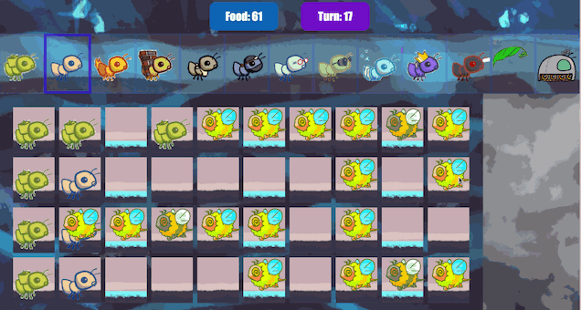

# Project 3: Ants Vs. SomeBees <kbd>[ants.zip](./ants.zip)</kbd>


​                                                                                                       *The bees are coming!*
​                                                                                                      *Create a better soldier*
​                                                                                                          *With inherit-ants.*

## Introduction

> **For full credit:**
>
> - Submit with Phase 1 complete by **Thursday, March 7** (worth 1 pt).
> - Submit with Phase 2 complete by **Tuesday, March 12** (worth 1 pt).
> - Submit with all phases complete by **Tuesday, March 19**.
>
> Solve the problems in order, since some later problems depend on earlier problems.
>
> The entire project can be completed with a partner.
>
> You can get 1 bonus point by submitting the entire project by **Monday, March 18**.

In this project, you will create a [tower defense](https://secure.wikimedia.org/wikipedia/en/wiki/Tower_defense) game called Ants Vs. SomeBees. As the ant queen, you populate your colony with the bravest ants you can muster. Your ants must protect their queen from the evil bees that invade your territory. Irritate the bees enough by throwing leaves at them, and they will be vanquished. Fail to pester the airborne intruders adequately, and your queen will succumb to the bees' wrath. This game is inspired by PopCap Games' [Plants Vs. Zombies](https://www.ea.com/studios/popcap/plants-vs-zombies).

This project uses an object-oriented programming paradigm, focusing on material from [Chapter 2.5](https://www.composingprograms.com/pages/25-object-oriented-programming.html) of Composing Programs. The project also involves understanding, extending, and testing a large program.

## Download starter files

The [ants.zip](https://web.archive.org/web/20240601061440/https://cs61a.org/proj/ants/ants.zip) archive contains several files, but all of your changes will be made to `ants.py`.

- `ants.py`: The game logic of Ants Vs. SomeBees
- `ants_plans.py`: The details of each difficulty level
- `ucb.py`: Utility functions for CS 61A
- `gui.py:` A graphical user interface (GUI) for Ants Vs. SomeBees.
- `ok`: The autograder
- `proj3.ok`: The `ok` configuration file
- `tests`: A directory of tests used by `ok`
- `libs`: A directory of libraries used by `gui.py`
- `static`: A directory of images and files used by `gui.py`
- `templates`: A directory of HTML templates used by `gui.py`

## Logistics

The project is worth 25 points. 23 points are for correctness, 1 point is for submitting Phase 1 by the first checkpoint date and 1 point is for submitting Phase 2 by the second checkpoint date.

You can get 1 EC point for submitting the entire project by **Monday, March 18**.

You will turn in the following files:

- `ants.py`

You do not need to modify or turn in any other files to complete the project. To submit the project, **submit the required files to the appropriate Gradescope assignment.**

For the functions that we ask you to complete, there may be some initial code that we provide. If you would rather not use that code, feel free to delete it and start from scratch. You may also add new function definitions as you see fit.

**However, please do not modify any other functions or edit any files not listed above**. Doing so may result in your code failing our autograder tests. Also, please do not change any function signatures (names, argument order, or number of arguments).

Throughout this project, you should be testing the correctness of your code. It is good practice to test often, so that it is easy to isolate any problems. However, you should not be testing *too* often, to allow yourself time to think through problems.

We have provided an **autograder** called `ok` to help you with testing your code and tracking your progress. The first time you run the autograder, you will be asked to **log in with your Ok account using your web browser**. Please do so. Each time you run `ok`, it will back up your work and progress on our servers.

The primary purpose of `ok` is to test your implementations.

If you want to test your code interactively, you can run

```python
python3 ok -q [question number] -i 
```

with the appropriate question number (e.g. `01`) inserted. This will run the tests for that question until the first one you failed, then give you a chance to test the functions you wrote interactively.

You can also use the debugging print feature in OK by writing

```python
 print("DEBUG:", x) 
```

which will produce an output in your terminal without causing OK tests to fail with extra output.

## The Game

A game of Ants Vs. SomeBees consists of a series of turns. In each turn, new bees may enter the ant colony. Then, new ants are placed to defend their colony. Finally, all insects (ants, then bees) take individual actions. Bees either try to move toward the end of the tunnel or sting ants in their way. Ants perform a different action depending on their type, such as collecting more food or throwing leaves at the bees. The game ends either when a bee reaches the end of the tunnel (ants lose), the bees destroy a `QueenAnt` if it exists (ants lose), or the entire bee fleet has been vanquished (ants win).



### Core concepts

**The Colony**. This is where the game takes place. The colony consists of several `Place`s that are chained together to form tunnels through which the bees travel. The colony also has some quantity of food which can be expended in order to place an ant in a tunnel.

**Places**. A place links to another place to form a tunnel. The player can put a single ant into each place. However, there can be many bees in a single place.

**The Hive**. This is the place where bees originate. Bees exit the beehive to enter the ant colony.

**Ants**. The player places an ant into the colony by selecting from the available ant types at the top of the screen. Each type of ant takes a different action and requires a different amount of colony food to place. The two most basic ant types are the `HarvesterAnt`, which adds one food to the colony during each turn, and the `ThrowerAnt`, which throws a leaf at a bee each turn. You will be implementing many more!

**Bees**. Each turn, a bee either advances to the next place in the tunnel if no ant is in its way, or it stings the ant in its way. Bees win when at least one bee reaches the end of a tunnel. In addition to the orange bees, there are yellow wasps that do double damage and a green boss bee that is quite difficult to vanquish.

### Core classes

The concepts described above each have a corresponding class that encapsulates the logic for that concept. Here is a summary of the main classes involved in this game:

- **`GameState`**: Represents the colony and some state information about the game, including how much food is available, how much time has elapsed, where the `AntHomeBase` is, and all the `Place`s in the game.
- **`Place`**: Represents a single place that holds insects. At most one `Ant` can be in a single place, but there can be many `Bee`s in a single place. `Place` objects have an `exit` to the left and an `entrance` to the right, which are also places. Bees travel through a tunnel by moving to a `Place`'s `exit`.
- **`Hive`**: Represents the place where `Bee`s start out (on the right of the tunnel).
- **`AntHomeBase`**: Represents the place `Ant`s are defending (on the left of the tunnel). If `Bee`s get here, they win :(
- **`Insect`**: A base class for `Ant` and `Bee`. Each insect has a `health` attribute representing its remaining health and a `place` attribute representing the `Place` where it is currently located. Each turn, every active `Insect` in the game performs its `action`.
- **`Ant`**: Represents ants. Each `Ant` subclass has special attributes or a special `action` that distinguish it from other `Ant` types. For example, a `HarvesterAnt` gets food for the colony and a `ThrowerAnt` attacks `Bee`s. Each ant type also has a `food_cost` attribute that indicates how much it costs to deploy one unit of that type of ant.
- **`Bee`**: Represents bees. Each turn, a bee either moves to the `exit` of its current `Place` if the `Place` is not `blocked` by an ant, or stings the ant occupying its same `Place`.

### Game Layout

Below is a visualization of a GameState.


To help visualize how all the classes fit together, [here](./ants_diagram.pdf) is a diagram of all of the classes and their inheritance relationships.

## Phase 1: Basic gameplay

> **For full credit:** submit with Phase 1 complete by **Thursday, March 7** (worth 1 pt).

In the first phase you will complete the implementation that will allow for basic gameplay with the two basic `Ant`s: the `HarvesterAnt` and the `ThrowerAnt`.

### Problem 0 (0 pt)

Answer a set of conceptual questions after you have read the *entire* `ants.py` file by running this `ok` command:

```python
python3 ok -q 00 -u
```

If you get stuck while answering these questions, you can try reading through `ants.py` again or asking questions on Ed.

> **A note on unlocking tests**: If you'd like to review the unlocking questions after you have completed the unlocking test, you can navigate to (within the `ants` folder), the `tests` folder. For example, after unlocking Problem 0, you can review the unlocking test at `tests/00.py`.

### Problem 1 (1 pt)

**Part A**: Currently, there is no cost for placing any type of `Ant`, and so there is no challenge to the game. The base class `Ant` has a `food_cost` of zero. Override this class attribute for `HarvesterAnt` and `ThrowerAnt` according to the "Food Cost" column in the table below.


**Part B**: Now that placing an `Ant` costs food, we need to be able to gather more food! To fix this issue, implement the `HarvesterAnt` class. A `HarvesterAnt` is a type of `Ant` that adds one food to the `gamestate.food` total as its `action`.

Before writing any code, unlock the tests to verify your understanding of the question:

```python
python3 ok -q 01 -u
```

Once you are done unlocking, begin implementing your solution. You can check your correctness with:

```python
python3 ok -q 01
```

### Problem 2 (1 pt)

In this problem, you'll complete `Place.__init__` by adding code that tracks entrances. Right now, a `Place` keeps track only of its `exit`. We would like a `Place` to keep track of its entrance as well. A `Place` needs to track only one `entrance`. Tracking entrances will be useful when an `Ant` needs to see what `Bee`s are in front of it in the tunnel.

However, simply passing an entrance to a `Place` constructor will be problematic; we would need to have both the exit and the entrance before creating a `Place`! (It's a [chicken or the egg](https://en.wikipedia.org/wiki/Chicken_or_the_egg) problem.) To get around this problem, we will keep track of entrances in the following way instead. `Place.__init__` should use this logic:

- A newly created `Place` always starts with its `entrance` as `None`.
- If the `Place` has an `exit`, then the `exit`'s `entrance` is set to that `Place`.

> *Hint:* Remember that when the `__init__` method is called, the first parameter, `self`, is bound to the newly created object

> *Hint:* Try drawing out two `Place`s next to each other if things get confusing. In the GUI, a place's `entrance` is to its right while the `exit` is to its left.

> *Hint:* Remember that `Place`s are not stored in a list, so you can't index into anything to access them. This means that you **can't** do something like `colony[index + 1]` to access an adjacent `Place`. How *can* you move from one place to another?


Before writing any code, unlock the tests to verify your understanding of the question:

```python
python3 ok -q 02 -u
```

Once you are done unlocking, begin implementing your solution. You can check your correctness with:

```python
python3 ok -q 02
```

### Problem 3 (2 pt)

In order for a `ThrowerAnt` to throw a leaf, it must know which bee to hit. The provided implementation of the `nearest_bee` method in the `ThrowerAnt` class only allows them to hit bees in the same `Place`. Your job is to fix it so that a `ThrowerAnt` will `throw_at` the nearest bee in front of it **that is not still in the `Hive`.** This includes bees that are in the same `Place` as a `ThrowerAnt`

> *Hint:* All `Place`s have an `is_hive` attribute which is `True` when that place is the `Hive`.

Change `nearest_bee` so that it returns a random `Bee` from the nearest place that contains bees. Your implementation should follow this logic:

- Start from the current `Place` of the `ThrowerAnt`.
- For each place, return a random bee if there is any, and if not, inspect the place in front of it (stored as the current place's `entrance`).
- If there is no bee to attack, return `None`.

> *Hint*: The `random_bee` function provided in `ants.py` returns a random bee from a list of bees or `None` if the list is empty.

> *Hint*: As a reminder, if there are no bees present at a `Place`, then the `bees` attribute of that `Place` instance will be an empty list.

> *Hint*: Having trouble visualizing the test cases? Try drawing them out on paper! The sample diagram provided in [Game Layout](#game-layout) shows the first test case for this problem.

Before writing any code, unlock the tests to verify your understanding of the question:

```python
python3 ok -q 03 -u
```

Once you are done unlocking, begin implementing your solution. You can check your correctness with:

```python
python3 ok -q 03
```

