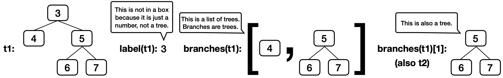

# Discussion 5: Trees

# Trees

For a tree `t`:

- Its root label can be any value, and `label(t)` returns it.
- Its branches are trees, and `branches(t)` returns a list of branches.
- An identical tree can be constructed with `tree(label(t), branches(t))`.
- You can call functions that take trees as arguments, such as `is_leaf(t)`.
- That's how you work with trees. No `t == x` or `t[0]` or `x in t` or `list(t)`, etc.
- There's no way to change a tree (that doesn't violate an abstraction barrier).

Here's an example tree `t1`, for which its branch `branches(t1)[1]` is `t2`.

```python
t2 = tree(5, [tree(6), tree(7)])
t1 = tree(3, [tree(4), t2])
```



A path is a sequence of trees in which each is the parent of the next.

### Tree Implementation

You don't need to know how `tree`, `label`, and `branches` are implemented in order to use them correctly, but here is the implementation from lecture.

```pyth
def tree(label, branches=[]):
    for branch in branches:
        assert is_tree(branch), 'branches must be trees'
    return [label] + list(branches)

def label(tree):
    return tree[0]

def branches(tree):
    return tree[1:]

def is_leaf(tree):
    return not branches(tree)

def is_tree(tree):
    if type(tree) != list or len(tree) < 1:
        return False
    for branch in branches(tree):
        if not is_tree(branch):
            return False
    return True
```

### Q1: Warm Up

What value is bound to `result`?

```python
result = label(min(branches(max([t1, t2], key=label)), key=label))
```

How convoluted! (That's a big word.)

Here's a quick refresher on how `key` functions work with `max` and `min`,

`max(s, key=f)` returns the item `x` in `s` for which `f(x)` is largest.

```python
>>> s = [-3, -5, -4, -1, -2]
>>> max(s)
-1
>>> max(s, key=abs)
-5
>>> max([abs(x) for x in s])
5
```

Therefore, `max([t1, t2], key=label)` returns the tree with the largest label, in this case `t2`.

In case you're wondering, this expression does not violate an abstraction barrier. `[t1, t2]` and `branches(t)` are both lists (not trees), and so it's fine to call `min` and `max` on them.

### Q2: Has Path

Implement `has_path`, which takes a tree `t` and a list `p`. It returns whether there is a path from the root of `t` with labels `p`. For example, `t1` has a path from its root with labels `[3, 5, 6]` but not `[3, 4, 6]` or `[5, 6]`.

**Important**: Before trying to implement this function, discuss these questions from lecture about the recursive call of a tree processing function:

- What recursive calls will you make?
- What type of values do they return?
- What do the possible return values mean?
- How can you use those return values to complete your implementation?

If you get stuck, you can view our answers to these questions by clicking the hint button below, but *please* don't do that until your whole group agrees.

```python
def has_path(t, p):
    """Return whether tree t has a path from the root with labels p.

    >>> t2 = tree(5, [tree(6), tree(7)])
    >>> t1 = tree(3, [tree(4), t2])
    >>> has_path(t1, [5, 6])        # This path is not from the root of t1
    False
    >>> has_path(t2, [5, 6])        # This path is from the root of t2
    True
    >>> has_path(t1, [3, 5])        # This path does not go to a leaf, but that's ok
    True
    >>> has_path(t1, [3, 5, 6])     # This path goes to a leaf
    True
    >>> has_path(t1, [3, 4, 5, 6])  # There is no path with these labels
    False
    """
    if p == [label(t)]:  # when len(p) is 1
        return True
    elif label(t) != p[0]:
        return False
    else:
        "*** YOUR CODE HERE ***"
        return True in [has_path(branch, p[1:]) for branch in branches(t)]
```

### Q3: Find Path

Implement `find_path`, which takes a tree `t` with unique labels and a value `x`. It returns a list containing the labels of the nodes along a path from the root of `t` to a node labeled `x`.

If `x` is not a label in `t`, return `None`. Assume that the labels of `t` are unique.

First talk through how to make and use the recursive call. (Try it yourselves; don't just click the hint button. That's how you learn.)

```python
def find_path(t, x):
    """
    >>> t2 = tree(5, [tree(6), tree(7)])
    >>> t1 = tree(3, [tree(4), t2])
    >>> find_path(t1, 5)
    [3, 5]
    >>> find_path(t1, 4)
    [3, 4]
    >>> find_path(t1, 6)
    [3, 5, 6]
    >>> find_path(t2, 6)
    [5, 6]
    >>> print(find_path(t1, 2))
    None
    """
    if label(t) == x:
        return [label(t)]
    for b in branches(t):
        path = find_path(b, x)
        if path:
            return [label(t)] + path
    return None
```

